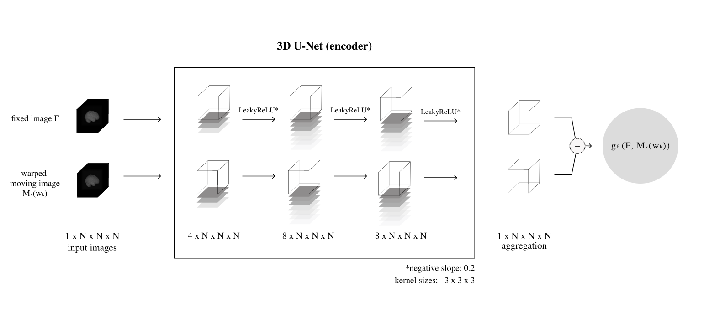
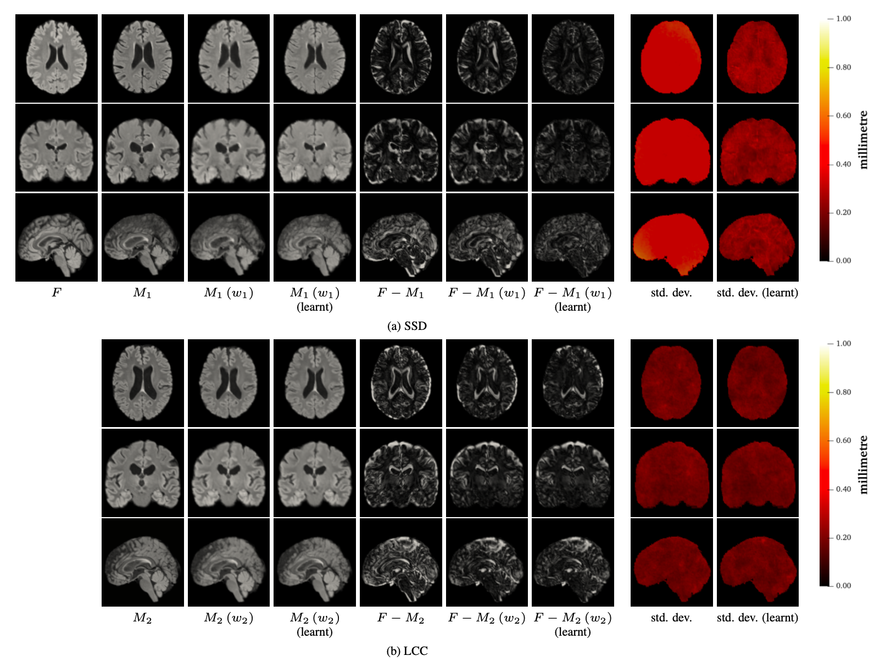
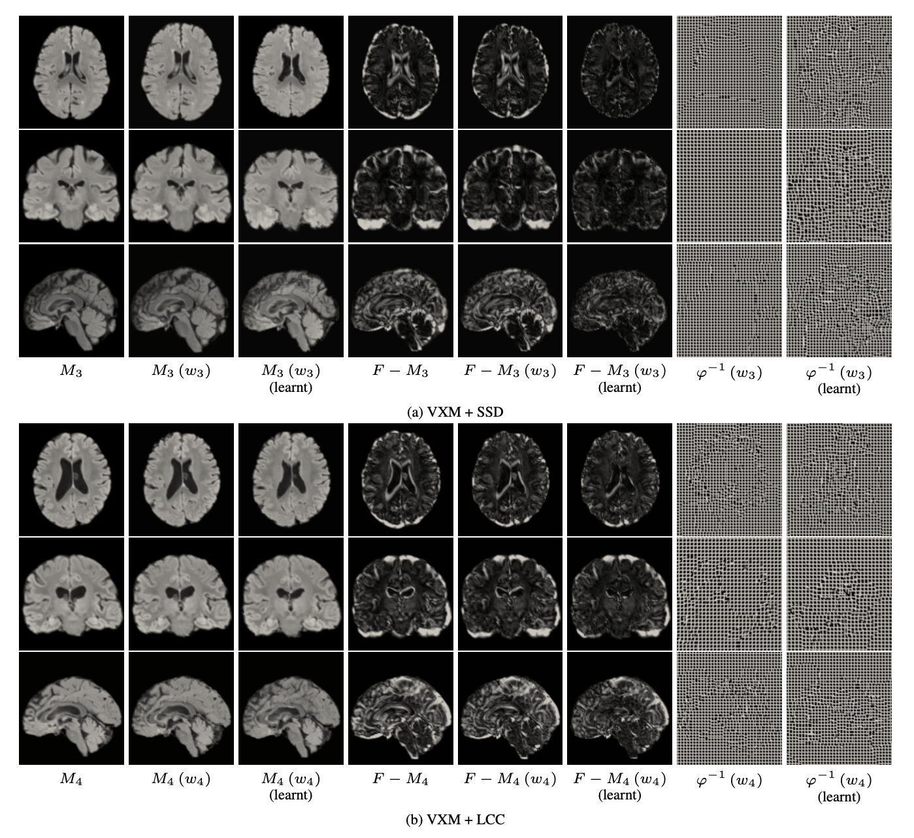
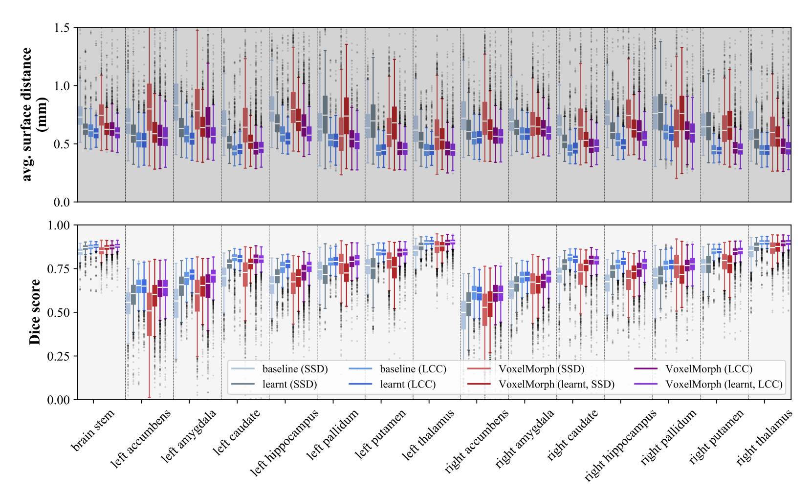

LearnSim
============

We provide our PyTorch implementation of the paper 
"A variational Bayesian method for similarity learning in atlas-based non-rigid image registration" accepted in CVPR 2022.

*link to the paper*

We propose a novel variational Bayesian formulation for diffeomorphic non-rigid registration of medical images. The method learns a data-specific similarity metric for atlas-based image registration in an unsupervised way. The proposed framework is general and may be used together with many existing image registration models. The use of a learnt similarity metric parametrised as a neural network yields more accurate results than use of traditional similarity metrics, without a negative impact on the transformation smoothness or image registration speed.


Model
---------

**Neural network parametrising the similarity metric initialised to SSD**



The architecture for SSD consists of a 3D U-Net encoder initialised to the Dirac delta function and followed by a 1D convolutional layer. Feature maps output by the 3D U-Net are used to calculate a weighted sum returned by the aggregation layer.

Results and Plots
------------

**The output on two sample images in the test split when using the baseline and the learnt similarity metrics**



In case of SSD, the average improvement in DSC over the baseline on the image above is approximately 27.2 percentage 
points and in case of LCC, it is approximately 6.5 percentage points. The improvement is clearly visible by visual 
inspection. The uncertainty estimates are visualised as the standard deviation of the displacement field, 
based on 50 samples. Use of the learnt similarity metric which had been initialised to SSD results in better calibration of uncertainty estimates than in case of the baseline, e.g. higher uncertainty within regions with homogeneous voxel intensities.

**The output on two sample images in the test split when using VXM with the baseline and the learnt similarity metrics**



**Comparison of ASDs and DSCs calculated for the subcortical structure segmentation**



ASDs and DSCs calculated for the subcortical structure segmentation when aligning images in the test split using the baseline and learnt similarity metrics. For the probabilistic methods, we use five samples per image, which results in a total of 2,679 samples. The results with the learnt metrics show an improvement over the baselines, i.e. SSD and LCC. On average, when comparing different methods, DSC increases in the range of 0.6 to 4.1 percentage points and ASD decreases in the range of 0.01 to 0.1 mm. We provide details on the statistical significance of the improvement in the main text.

Prerequisites
-------------
- Linux
- Python 3
- NVIDIA GPU + CUDA CuDNN

**Getting started**

Clone this repo:

```
git clone https://github.com/dgrzech/learnsim
cd learnsim
```

Install requirements:
```
pip install requirements.txt
```

Download dataset:
```shell
# missing dataset command!
```

Usage
------------
to train the similarity metric:
```
CUDA_VISIBLE_DEVICES=<device_ids> python -m torch.distributed.launch --nproc_per_node=NO_GPUS train.py -c path/to/config.json
```

`config.json` specifies the configuration to use for training, incl. the similarity metric parametrisation and the values of hyperparameters

to test:
```
CUDA_VISIBLE_DEVICES=<device_id> python -m torch.distributed.launch --nproc_per_node=1 test.py -c path/to/config.json -r path/to/checkpoint.pt
```

Config files
-------------
A config file is required for training. These parameters are defined in the config file:
```json
{
	"name": "SSD",
	"no_GPUs": 2,
	"model": {
		"type": "CNN_SSD", // or CNN_LCC
		"args": {
			"learnable": true,
			"no_features": [4, 8, 8],
			"activation": {
				"type": "LeakyReLU",
				"args": {
					"negative_slope": 0.2
				}
			}
		}
	},
	"q_f": { // q_f distribution parameters
		"type": "LowRankMultivariateNormalDistribution",
		"args": {
			"sigma_init": 0.1,
			"u_init": 0.1,
			"loc_learnable": false,
			"cov_learnable": true
		}
	},
	"data_loss": {
		"type": "SSD" // Similarity metric loss
	},
	"reg_loss": {   // Regularization loss parameters
		"type": "RegLoss_L2",  
		"args": {
			"diff_op": "GradientOperator",
			"w_reg": 1.8
		}
	},
	"entropy_loss": {
		"type": "EntropyMultivariateNormal"
	},
	"transformation_module": {
		"type": "SVF_3D",
		"args": {
			"no_steps": 12
		}
	},
	"registration_module": {
		"type": "RegistrationModule"
	},
	"optimizer_q_f": {
		"type": "Adam",
		"args": {
			"lr": 0.001
		}
	},
	"optimizer_q_phi": {
		"type": "Adam",
		"args": {
			"lr": 0.00001
		}
	},
	"optimizer_q_v": {
		"type": "Adam",
		"args": {
			"lr": 0.01
		}
	},
	"data_loader": {
		"type": "LearnSimDataLoader",
		"args": {
			"im_pairs": "/vol/bitbucket/dig15/datasets/mine/biobank/train_biobank_1500.csv",
			"dims": [128, 128, 128],
			"sigma_v_init": 0.5,
			"u_v_init": 0.1,
			"batch_size": 5,
			"no_workers": 5,
			"test": false
		}
	},
	"Sobolev_grad": {
		"enabled": true,
		"s": 3,
		"lambda": 0.5
	},
	"trainer": {
		"uniform_noise": {
			"enabled": true,
			"magnitude": 0.1
		},
		"no_epochs": 50,
		"no_iters_q_v": 1024,
		"no_samples_test": 5,
		"log_period": 512,
		"save_dir": "saved/"
	}
}

```

Citation
-------------

If you use this code for your research, please cite our [paper](http://scholar.google.com)

```
@inproceedings{  
}
```