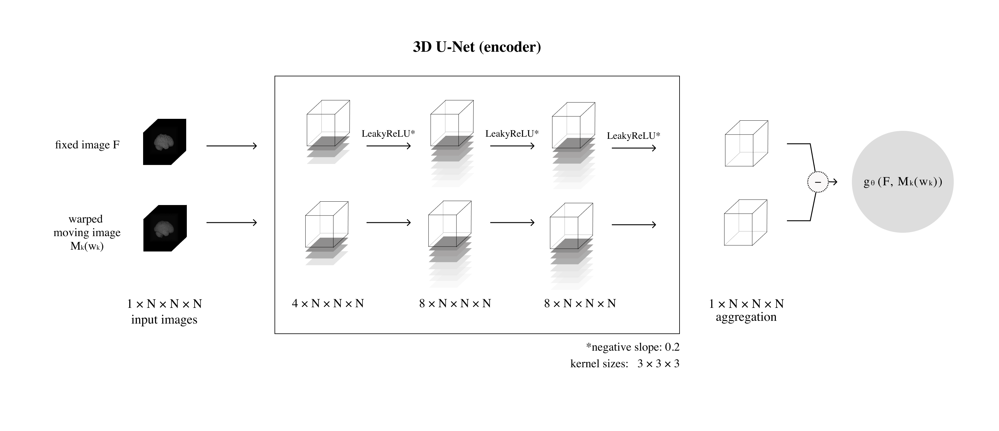
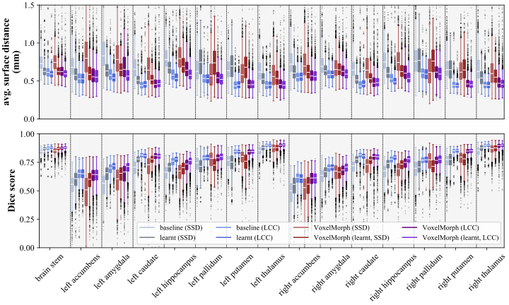

A variational Bayesian method for similarity learning in non-rigid image registration
============

We provide the source code and the trained models used in the research presented at CVPR 2022. The model learns in an unsupervised way a data-specific similarity metric for atlas-based non-rigid image registration. The use of a learnt similarity metric parametrised as a neural network yields more accurate results than use of traditional similarity metrics, without a negative impact on the transformation smoothness or image registration speed.

## Model



**Neural network parametrising the similarity metric initialised to SSD.** The model consists of a 3D U-Net encoder, which is initialised to the Dirac delta function and followed by a 1D convolutional layer. Feature maps output by the 3D U-Net are used to calculate a weighted sum returned by the aggregation layer. Before training, the output of the neural network approximates the value of SSD. We would like to thank [Rhea Jiang](https://www.linkedin.com/in/rhea-jiang/) from the Harvard Graduate School of Design for the figure. 

## Results



**Average surface distances and Dice scores calculated on subcortical structure segmentations when aligning images in the test split using the baseline and learnt similarity metrics.** The learnt models show clear improvement over the baselines. We provide details on the statistical significance of the improvement in the paper.

## Usage

### Set-up

The experiments were run on a system with Ubuntu 20.04.4 and Python 3.8.6. To install the necessary Python libraries run the following command:

```
pip install requirements.txt
```

### Training

Examples of json files with the model parameters can be found in the folder `/configs`. Use the following command to train a similarity metric:
```
CUDA_VISIBLE_DEVICES=<device_ids> python -m torch.distributed.launch --nproc_per_node=<no_gpus> train.py -c <path/to/config.json>
```

### Testing

Use the following command to align images:
```
CUDA_VISIBLE_DEVICES=<device_id> python -m torch.distributed.launch --nproc_per_node=1 test.py -c <path/to/config.json> -r <path/to/checkpoint.pt>
```

### Pre-trained models

For training and testing, we used brain MRI scans from the [UK Biobank](https://www.ukbiobank.ac.uk/). Click on the links below to download the pre-trained models.

|Model          | Baseline                                          | Learnt                                          |
| ------------- | -------------                                     | -------------                                   |
|SSD            | N/A                                               | [12 MB](pretrained_models/SSD_learnt.tar.gz)    |
|LCC            | N/A                                               | [22 MB](pretrained_models/LCC_learnt.tar.gz)    |
|VXM + SSD      | [1 MB](pretrained_models/VXM_SSD_baseline.tar.gz) | [1 MB](pretrained_models/VXM_SSD_learnt.tar.gz) |
|VXM + LCC      | [1 MB](pretrained_models/VXM_LCC_baseline.tar.gz) | [1 MB](pretrained_models/VXM_LCC_learnt.tar.gz) |

Citation
-------------

If you use this code, please cite our paper.

Daniel Grzech, Mohammad Farid Azampour, Ben Glocker, Julia Schnabel, Nassir Navab, Bernhard Kainz, and Loïc Le Folgoc. **A variational Bayesian method for similarity learning in medical image registration.** CVPR 2022.

```
@inproceedings{Grzech2022,
    author = {Grzech, Daniel and Azampour, Mohammad Farid and Glocker, Ben and Schnabel, Julia and Navab, Nassir and Kainz, Bernhard and {Le Folgoc}, Lo{\"{i}}c},
    title = {{A variational Bayesian method for similarity learning in medical image registration}},
    booktitle = {CVPR},
    year = {2022}
}
```